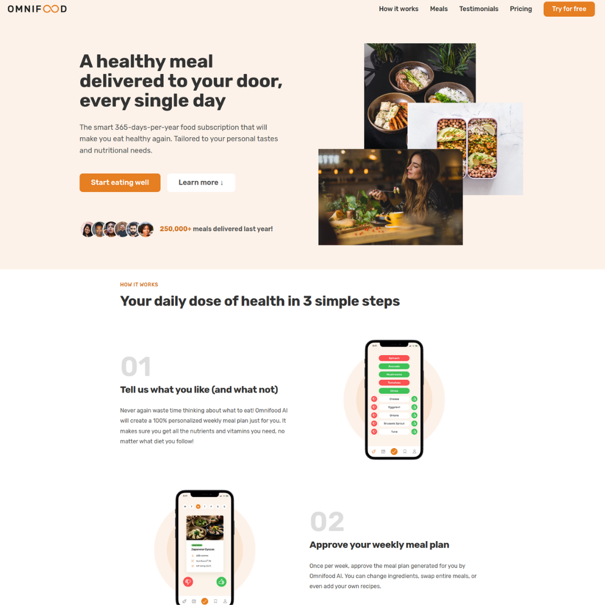

# OMNIFOOD PROJECT 

This is a project that I have created to practice my HTML and CSS skills. It is a fictional food delivery service called
Omnifood. The project is a single page website that includes a header, features, how it works, cities, customer 
testimonials, sign up, and contact sections. The website is fully responsive and works on all devices.

## Landing Page

### Github page link
[Omnifood](https://darrylestrada97.github.io/HTML_CSS/)
## Technologies Used
- HTML
- CSS
- ICONS from HEROICONS and Ionicons.
- Google Fonts

## Features
- Fully responsive
- Smooth scrolling

## Setup
To run this project, download the code and open the 07-Omnifood-Desktop/index.html file in your browser.

## Status
Project is: _progress_

## Contact
Created by [@darrylestrada97](mailto:darrylestrada97@gmail.com) - feel free to contact me!
